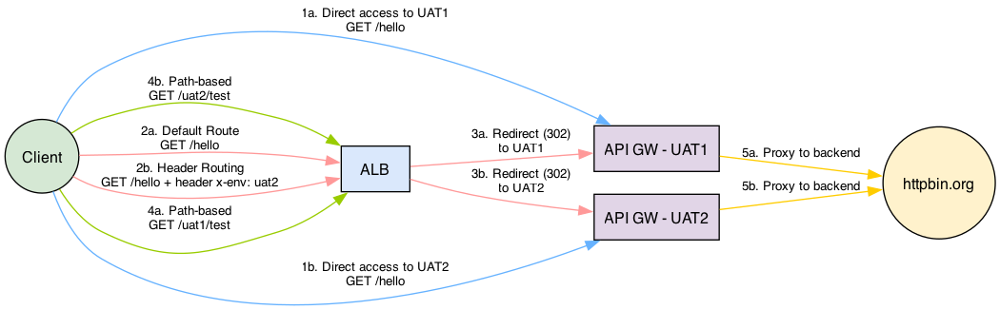
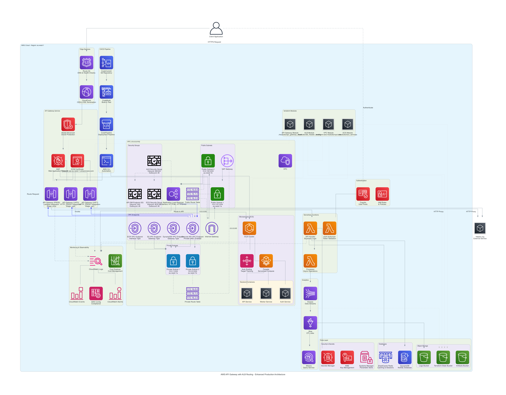

# AWS API Gateway with Header-Based and Path-Based Routing

This project demonstrates an AWS API Gateway architecture with both header-based and path-based routing using Application Load Balancer. The implementation uses a modular Terraform approach for better maintainability and scalability.

## Architecture Overview

This architecture demonstrates:

1. **Dual Routing Strategies**:
   - **Header-Based Routing** - Route traffic based on HTTP headers using ALB
   - **Path-Based Routing** - Route traffic based on URL paths (e.g., /uat1/*, /uat2/*)
2. **API Gateway with Stages** - UAT1 and UAT2 stages for different environments
3. **VPC Integration** - Secure access via VPC endpoints
4. **Terraform Modularity** - Reusable modules for API Gateway and ALB configuration


## Key Components

### 1. API Gateway (HTTP API)
- Created using the `api_gateway_mock` module
- Two stages: UAT1 and UAT2
- HTTP_PROXY integrations with httpbin.org
- Routes defined with proper paths ("/hello")
- Auto-deployment enabled for immediate changes

### 2. Dual Routing Strategy (ALB)
- **Header-Based Routing**: 
  - Routes traffic based on the `x-env` header (uat1, uat2)
  - Default route directs to UAT1
- **Path-Based Routing**:
  - Routes based on URL path patterns (/uat1/*, /uat2/*)
  - Works alongside header-based routing for maximum flexibility

### 3. VPC Integration
- Private VPC endpoint for API Gateway
- Security groups for ALB and API Gateway endpoint
- Target groups configured with appropriate health checks
- Public and private subnets across multiple availability zones

## Getting Started

### Prerequisites

- Terraform >= 1.0.0
- AWS CLI configured with appropriate credentials
- AWS account with permissions to create required resources

### Setup

1. Clone this repository
2. Initialize Terraform:
   ```bash
   terraform init
   ```

3. Apply the Terraform configuration:
   ```bash
   terraform apply
   ```

4. After successful deployment, Terraform will output important endpoints and DNS names:
   - `api_gateway_endpoint`: Direct endpoint for the API Gateway
   - `load_balancer_dns`: DNS name for the Application Load Balancer

## How it Works

### Request Flow

1. Client makes a request using one of two methods:
   - Direct to ALB with a header `x-env: uat2` for header-based routing
   - Direct to ALB with a path-based URL (e.g., `/uat1/hello`) for path-based routing
2. ALB evaluates both the headers and path patterns to determine the correct target
3. Request is forwarded to the appropriate API Gateway stage through a VPC endpoint
4. API Gateway proxies the request to httpbin.org
5. Response flows back through the same path to the client



### Testing

The repository includes a testing script (`test_endpoints.sh`) that validates all routing scenarios:

```bash
# Make the script executable
chmod +x test_endpoints.sh

# Run the tests
./test_endpoints.sh
```

Alternatively, you can test each endpoint manually:

#### Direct API Gateway Access:

```bash
# Access UAT1 environment directly
curl https://[API_GATEWAY_ID].execute-api.[REGION].amazonaws.com/uat1/hello

# Access UAT2 environment directly
curl https://[API_GATEWAY_ID].execute-api.[REGION].amazonaws.com/uat2/hello
```

#### Through ALB with Header Routing:

```bash
# Default route (UAT1)
curl http://[LOAD_BALANCER_DNS]/hello

# UAT1 with explicit path
curl http://[LOAD_BALANCER_DNS]/uat1/hello

# UAT2 via header
curl -H "x-env: uat2" http://[LOAD_BALANCER_DNS]/hello

# UAT2 via path
curl http://[LOAD_BALANCER_DNS]/uat2/hello
```

## Module Details

### API Gateway Module (`modules/api_gateway_mock`)
The `api_gateway_mock` module creates:
- HTTP API Gateway with CORS enabled
- Multiple stages with auto-deployment
- HTTP_PROXY integrations with httpbin.org
- Stage-specific routes with correct path configurations
- Route configuration that properly handles stage prefixes

```hcl
# Key components in the API Gateway module
resource "aws_apigatewayv2_api" "this" {
  name          = "${var.name}-${var.environment}"
  protocol_type = "HTTP"
  cors_configuration {
    allow_origins = ["*"]
    allow_methods = ["GET", "POST", "PUT", "DELETE"]
    allow_headers = ["*"]
  }
}

resource "aws_apigatewayv2_stage" "this" {
  for_each = var.stages

  api_id      = aws_apigatewayv2_api.this.id
  name        = each.key
  auto_deploy = true
  
  default_route_settings {
    detailed_metrics_enabled = true
    throttling_burst_limit   = 100
    throttling_rate_limit    = 50
  }
}

resource "aws_apigatewayv2_integration" "this" {
  for_each = var.stages

  api_id           = aws_apigatewayv2_api.this.id
  integration_type = "HTTP_PROXY"
  # Integration URI points to an external service
  integration_uri  = "https://httpbin.org/${each.key}"
}

resource "aws_apigatewayv2_route" "this" {
  for_each = var.stages

  api_id    = aws_apigatewayv2_api.this.id
  route_key = "GET /hello"
  target    = "integrations/${aws_apigatewayv2_integration.this[each.key].id}"
}
```

### ALB Header Routing Module (`modules/alb_header_routing`)
The `alb_header_routing` module creates:
- HTTP listener on the ALB
- Target groups with appropriate health checks
- Listener rules with both header and path pattern conditions
- Target group attachments for private IP addresses

```hcl
# Key components in the ALB Header Routing module
resource "aws_lb_listener" "http" {
  load_balancer_arn = var.load_balancer_arn
  port              = 80
  protocol          = "HTTP"

  default_action {
    type             = "forward"
    target_group_arn = aws_lb_target_group.this[local.default_route].arn
  }
}

resource "aws_lb_target_group" "this" {
  for_each = var.header_routes

  name     = "${var.name}-${each.key}"
  port     = each.value.port
  protocol = each.value.protocol
  vpc_id   = var.vpc_id

  health_check {
    path                = each.value.health_check_path
    port                = "traffic-port"
    healthy_threshold   = 3
    unhealthy_threshold = 3
    timeout             = 5
    interval            = 30
    matcher             = each.value.health_check_matcher
  }
}

resource "aws_lb_listener_rule" "header_based" {
  for_each = var.header_routes

  listener_arn = aws_lb_listener.http.arn
  priority     = each.value.priority

  action {
    type             = "forward"
    target_group_arn = aws_lb_target_group.this[each.key].arn
  }

  condition {
    http_header {
      http_header_name = "x-env"
      values           = [each.key]
    }
  }
}

resource "aws_lb_listener_rule" "path_based" {
  for_each = var.header_routes

  listener_arn = aws_lb_listener.http.arn
  priority     = each.value.priority + 100

  action {
    type             = "forward"
    target_group_arn = aws_lb_target_group.this[each.key].arn
  }

  condition {
    path_pattern {
      values = ["/${each.key}/*"]
    }
  }
}
```

## Variables

The following variables can be customized:

- `aws_region`: AWS region to deploy resources (default: eu-west-1)
- `project_name`: Name of the project (default: api-gateway-lb)
- `vpc_cidr`: CIDR block for VPC (default: 10.0.0.0/16)
- `availability_zones`: List of availability zones
- `private_subnet_cidrs`: CIDR blocks for private subnets
- `public_subnet_cidrs`: CIDR blocks for public subnets
- `stages`: Map of API Gateway stages to create
- `target_ips`: Map of IPs for each environment
- `tags`: Tags to apply to all resources

## Health Check Configuration

Health checks are configured for both UAT1 and UAT2 environments:

```hcl
header_routes = {
  uat1 = {
    port               = 80
    protocol           = "HTTP"
    priority           = 100
    target_ips         = [local.target_ips.uat1]
    health_check_path  = "/uat1/hello"
    health_check_matcher = "200,404"
  }
  uat2 = {
    port               = 80
    protocol           = "HTTP"
    priority           = 200
    target_ips         = [local.target_ips.uat2]
    health_check_path  = "/uat2/hello"
    health_check_matcher = "200,404"
  }
}
```

## Security Considerations

- The load balancer is public-facing but only accepts HTTP traffic on port 80
- API Gateway is not directly exposed to the internet (private integration)
- Security groups are configured to allow only necessary traffic
- API Gateway is accessed via VPC endpoint for added security
- CORS is enabled on the API Gateway for cross-origin requests

## Enhanced Production Architecture

For production environments, the architecture can be extended with additional AWS services for enhanced security, scalability, and observability. The enhanced architecture includes:



### Frontend Services
- **Route 53**: DNS management with health checks
- **CloudFront**: CDN and edge caching for API responses
- **Shield Advanced**: DDoS protection
- **WAF**: Web Application Firewall with security rules

### Authentication & Authorization
- **Cognito**: User pools for authentication
- **IAM Roles**: Fine-grained permission management
- **Lambda Authorizers**: Token validation and authorization

### Serverless Components
- **Lambda Functions**: Business logic implementation
- **API Gateway Lambda Integration**: Direct Lambda invocation
- **Production Stage**: Separate from testing environments

### Microservices & Containers
- **ECS with Fargate**: Containerized microservices
- **Auto Scaling**: Dynamic adjustment of resources
- **Backend Services**: Authentication, API, and worker services

### Data Layer
- **DynamoDB**: NoSQL database for API data
- **ElastiCache (Redis)**: Caching and session management
- **S3 Buckets**: Log storage and artifacts
- **Secrets Manager**: Secure storage of credentials

### Analytics & Monitoring
- **CloudWatch**: Comprehensive logging and monitoring
- **Kinesis**: Data streaming for analytics
- **Glue & Athena**: Data processing and querying
- **AWS Config**: Configuration compliance

### CI/CD Pipeline
- **CodeCommit**: Source code repository
- **CodeBuild**: Building and testing
- **CodePipeline**: Deployment automation
- **AWS CLI**: Command-line automation

### Additional Security
- **KMS**: Encryption key management
- **Parameter Store**: Configuration management
- **VPC Endpoints**: For multiple AWS services
- **Additional Security Groups**: Tightly controlled access

## Extending the Infrastructure

To implement the enhanced architecture, additional Terraform modules would be required:

1. **Edge Module**: For CloudFront and WAF configuration
2. **Authentication Module**: For Cognito and IAM setup
3. **Lambda Module**: For serverless function deployment
4. **ECS Module**: For containerized services
5. **Database Module**: For DynamoDB and ElastiCache
6. **Monitoring Module**: For comprehensive CloudWatch setup
7. **CI/CD Module**: For deployment pipeline

## Troubleshooting

If you encounter "Not Found" errors:
1. Verify that the API Gateway routes are correctly configured
2. Check the ALB listener rules for both header and path pattern conditions
3. Ensure VPC endpoint is properly set up
4. Verify health checks are passing (ALB target group health status)
5. Check CloudWatch logs for API Gateway access logs

## Additional Infrastructure Diagrams

The `diagrams` directory contains visualizations of different aspects of the architecture:

- `architecture_diagram.png`: High-level overview of the infrastructure
- `detailed_infrastructure.png`: Detailed breakdown of all AWS components
- `request_flow.png`: Visualization of request paths through the system
- `test_scenarios.png`: Diagram showing all test scenarios
- `deployment_diagram.png`: Current deployment architecture
- `enhanced_deployment_diagram.png`: Enhanced production architecture with additional services

## Resources

- [AWS API Gateway Documentation](https://docs.aws.amazon.com/apigateway/)
- [AWS Application Load Balancer Documentation](https://docs.aws.amazon.com/elasticloadbalancing/latest/application/)
- [Terraform AWS Provider Documentation](https://registry.terraform.io/providers/hashicorp/aws/latest/docs)
- [Terraform AWS Modules](https://registry.terraform.io/namespaces/terraform-aws-modules)
- [AWS Well-Architected Framework](https://aws.amazon.com/architecture/well-architected/)
- [API Gateway Best Practices](https://docs.aws.amazon.com/apigateway/latest/developerguide/api-gateway-best-practices.html) 