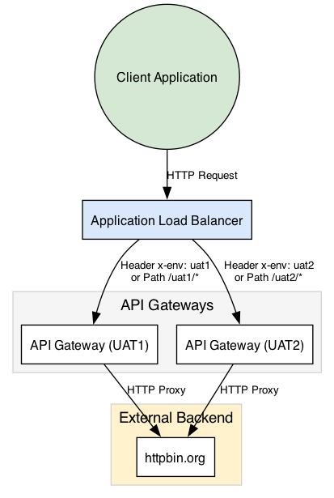
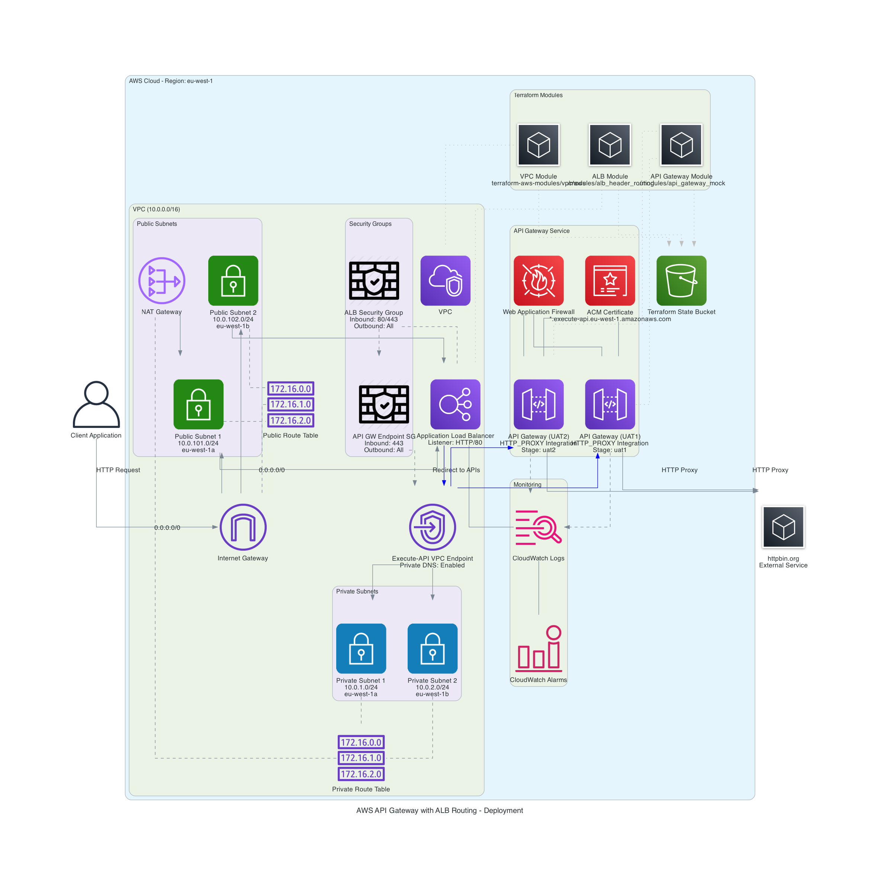

# AWS Multi-Stage API Gateway with Header and Path-Based Routing



## Overview

This repository contains a Terraform implementation of a multi-stage AWS API Gateway architecture with both header-based and path-based routing using Application Load Balancer. The architecture demonstrates a scalable and maintainable approach to deploying multiple environments (UAT1, UAT2) through a single infrastructure.

## Features

- **Dual Routing Strategies**: Use both header-based (`x-env` header) and path-based (`/uat1/*`, `/uat2/*`) routing
- **Multi-Environment Support**: Run multiple environments through the same infrastructure
- **Secure VPC Integration**: API Gateway accessed via VPC endpoints
- **Auto-Deployment**: Changes to API Gateway stages are automatically deployed
- **Health Checks**: Properly configured health checks for ALB target groups
- **Detailed Visualizations**: Architecture diagrams showing all services and connections
- **Testing Suite**: Comprehensive test script to validate all routing scenarios

## Architecture



The architecture consists of:

1. **API Gateway Layer**: HTTP API Gateways with different stages (UAT1, UAT2)
2. **Routing Layer**: ALB that routes traffic based on headers or URL paths
3. **Network Layer**: VPC with public and private subnets, endpoints, and security groups
4. **Terraform Modules**: Reusable modules for API Gateway and ALB configuration

## Enhanced Production Architecture

For production use cases, the repository includes an enhanced architecture diagram showing how to extend the solution with additional AWS services:


## Prerequisites

- Terraform ≥ 1.0.0
- AWS CLI configured with appropriate credentials
- AWS account with permissions to create the required resources
- Git

## Installation

1. Clone this repository:
   ```bash
   git clone https://github.com/amitmahajan78/aws-multi-stage-gateway.git
   cd aws-multi-stage-gateway
   ```

2. Initialize Terraform:
   ```bash
   terraform init
   ```

3. Apply the Terraform configuration:
   ```bash
   terraform apply
   ```

4. Test the deployment:
   ```bash
   ./test_endpoints.sh
   ```

## Usage

### Testing the API Gateway Directly

```bash
# UAT1 environment
curl https://<API_GATEWAY_ID>.execute-api.<REGION>.amazonaws.com/uat1/hello

# UAT2 environment
curl https://<API_GATEWAY_ID>.execute-api.<REGION>.amazonaws.com/uat2/hello
```

### Testing via the ALB

```bash
# Default route (UAT1)
curl http://<LOAD_BALANCER_DNS>/hello

# Path-based routing to UAT1
curl http://<LOAD_BALANCER_DNS>/uat1/hello

# Header-based routing to UAT2
curl -H "x-env: uat2" http://<LOAD_BALANCER_DNS>/hello

# Path-based routing to UAT2
curl http://<LOAD_BALANCER_DNS>/uat2/hello
```

## Project Structure

```
.
├── README.md                 # Repository documentation
├── main.tf                   # Main Terraform configuration
├── variables.tf              # Variable definitions
├── outputs.tf                # Output definitions
├── modules/                  # Terraform modules
│   ├── api_gateway_mock/     # API Gateway module
│   └── alb_header_routing/   # ALB routing module
├── diagrams/                 # Architecture diagrams
│   ├── deployment_diagram.png    # Current architecture
│   └── enhanced_deployment_diagram.png  # Production architecture
├── test_endpoints.sh         # Testing script
└── .gitignore                # Git exclusion patterns
```

## Configuration

Customize the deployment by modifying the following variables:

- `aws_region`: AWS region to deploy resources (default: eu-west-1)
- `project_name`: Name of the project (default: api-gateway-lb)
- `vpc_cidr`: CIDR block for VPC (default: 10.0.0.0/16)
- `stages`: Map of API Gateway stages to create

## Extending the Architecture

To implement the enhanced production architecture, additional modules would be required for:

1. Edge services (CloudFront, WAF)
2. Authentication (Cognito, Lambda authorizers)
3. Data layer (DynamoDB, ElastiCache)
4. CI/CD pipeline

## Cleaning Up

To remove all resources created by Terraform:

```bash
terraform destroy
```

## Contributing

1. Fork the repository
2. Create your feature branch (`git checkout -b feature/amazing-feature`)
3. Commit your changes (`git commit -m 'Add some amazing feature'`)
4. Push to the branch (`git push origin feature/amazing-feature`)
5. Open a Pull Request

## License

This project is licensed under the MIT License - see the [LICENSE](LICENSE) file for details.

## Acknowledgments

- AWS Documentation for API Gateway and ALB
- Terraform documentation and community modules 